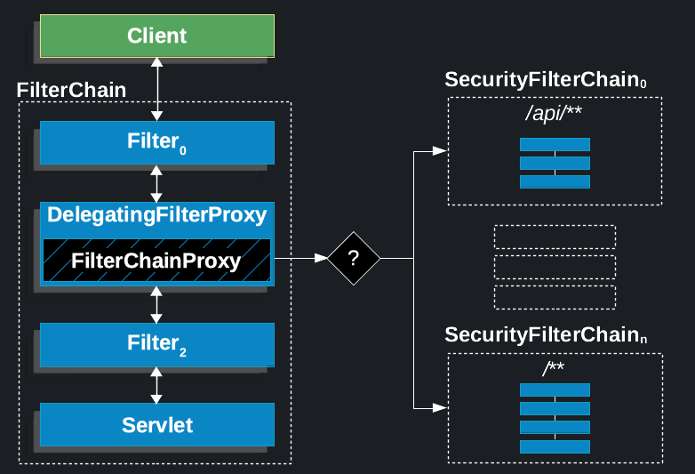
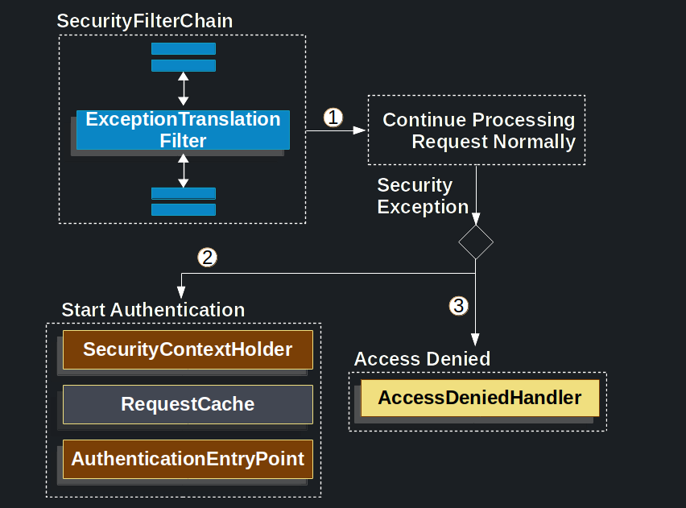

# SpringSecurity的最佳实践

## 项目依赖
- SpringBoot 3.1.9
- jjwt 0.12.5
- H2数据库
- Redis

## 所用芝士介绍

### Jwt
[“JSON Web Token (JWT) is defined a compact and self-contained way for securely transmitting information between parties as a JSON object.”](https://jwt.io/introduction)

Jwt由Header、Payload、Signature组成，组成形式：`xxxxx.yyyyy.zzzzz`
> jwt并不规定Header、Payload必须加密，默认以Base64编码，而Signature是用前两者进行摘要加密而得，用来验证数据是否被篡改。因此在非主动加密payload的情况下,不要存入敏感信息。

`Header`:通常包括两部分，令牌类型和使用的加密方法(在生产中还可添加一个`KeyID`，用来确定返回哪个密钥)
```json
{
  "alg": "HS256",
  "typ": "JWT"
}
```
`Payload`:由`claims`组成，`claims`有三种registered、public、private
- registered:非必需但建议包含的内容，比如**iss**(issuer),**exp**(expiration time),**sub**(subject),**aud**(audience)
- public:自定义的内容，比如 name("张三")
- private:除上面两者之外的，~~其实我也不知道什么时候用~~
```json
{  
  "sub": "1234567890",  
  "name": "John Doe",  
  "admin": true  
}
```
> 不需要区分那么仔细，只要自己约定claims不会造成歧义即可

`Signature`:由Header和Payload使用Base64编码后的字符串，以及一个密钥，通过Header中指定的加密方法得到的。
计算过程例子:`HMACSHA256( base64UrlEncode(header) + "." + base64UrlEncode(payload), secret)`

使用[jjwt](https://github.com/jwtk/jjwt)作为Jwt的实现，简单使用[例子](https://github.com/maifuwa/BestPractices/blob/master/SpringSecurityDemo/src/test/java/org/bigboss/springsecuritydemo/JwtTest.java)

### SpringSecurity
[Spring Security is a framework that provides authentication, authorization, and protection against common attacks. With first class support for securing both imperative and reactive applications, it is the de-facto standard for securing Spring-based applications.](https://spring.io/projects/spring-security#learn)

[中文文档](https://springdoc.cn/spring-security/)

SpringSecurity使用`Security Filter`来进行认证、授权、漏洞保护等等。
在这次实践中，我主要关注其中的`UsernamePasswordAuthenticationFilter`、`ExceptionTranslationFilter`、`AuthorizationFilter`

图为`Security Filter`与`Servlet filter`的相对位置，上述`Filter`在图中的SecurityFilterChain中



#### ExceptionTranslationFilter
SpringSecurity将用户重定向到登录页面流程：
1. 一个用户向其未被授权的资源（/private）发出一个未经认证的请求
2. `AuthorizationFilter`发现并没有认证，抛出一个`AccessDeniedException`表明未经认证的请求被拒绝
3. `ExceptionTranslationFilter`捕获到`AccessDeniedException`，启动`Start Authentication`，并发送一个重定向到配置的`AuthenticationEntryPoint`
4. 默认的`AuthenticationEntryPoint`实例是`LoginUrlAuthenticationEntryPoint`，它会重定向到默认的登录页面

图为`ExceptionTranslationFilter`的处理机制



因此我们只需要配置ExceptionTranslationFilter回调的`AuthenticationEntryPoint`和`AccessDeniedHandler`即可自定义认证失败后的处理流程。
SpringSecurity允许我们通过`HttpSecurity`的`exceptionHandling`来实现
```java
@Bean
public SecurityFilterChain securityFilterChain(HttpSecurity http) throws Exception {
    http
            // 客制异常处理
            .exceptionHandling((exceptions) -> exceptions
                    .authenticationEntryPoint((request, response, authException) -> {
                        // TODO:向浏览器请求登录凭证
                    })
                    .accessDeniedHandler((request, response, accessDeniedException) -> {
                        // TODO:提示用户权限不足
                    })
            );
    return http.build();
}
```

#### 表单登录
表单登录流程：
1. 当用户提交他们的用户名和密码时，`UsernamePasswordAuthenticationFilter`通过从`HttpServletRequest`实例中提取用户名和密码，创建一个`UsernamePasswordAuthenticationToken`，这是一种`Authentication`类型。
2. 接下来`UsernamePasswordAuthenticationToken`被传入`AuthenticationManager`实例，以进行认证。`AuthenticationManager`的细节取决于用户信息的存储方式。
3. 认证失败，清空`SecurityContextHolder`、回调`RememberMeServices.loginFail`、`AuthenticationFailureHandler`
4. 认证成功，通知`SessionAuthenticationStrategy`有新登录、将`Authentication`设置在`SecurityContextHolder`上、回调`RememberMeServices.loginSuccess`、发布`ApplicationEventPublisher`、回调`AuthenticationSuccessHandler`
> 用户信息的存储方式: 内存、JDBC、UserDetailsService、LDAP

在这个实践中，我通过[实现UserDetails](https://github.com/maifuwa/BestPractices/blob/master/SpringSecurityDemo/src/main/java/org/bigboss/springsecuritydemo/domain/MemberDetails.java)来自定义`Authentication`，通过配置`AuthenticationSuccessHandler`来自定义登录认证成功后的回调
```java
@Bean
public UserDetailsService userDetailsService() {
    return MemberServer::loadUserByUsername;
}

@Bean
public SecurityFilterChain securityFilterChain(HttpSecurity http) throws Exception {
    http
            .formLogin(form -> form
                    // 客制登录页面url
                    .loginProcessingUrl("/api/login").permitAll()
                    .successHandler((request, response, authentication) -> {
                        // TODO:登录成功后的回调
                    })
            );
    return http.build();
}
```
> `UserDetailsService`、`UserDetails`与`Authentication`的关系：`UserDetails`由`UserDetailsService`返回。`DaoAuthenticationProvider`验证`UserDetails`，然后返回一个`Authentication`，该`Authentication`的委托人principal是由配置的`UserDetailsService`返回的。

#### 授权
~~有时间再填坑,还有会话管理、漏洞防护、OAuth2~~

#### 注销
默认情况下，Spring Security 会建立一个`/logout`端点，所以不需要额外的代码
>由于`LogoutFilter`在`filter chain`中出现在`AuthorizationFilter`之前，所以默认情况下不需要明确允许`/logout`端点
```java
@Bean
public SecurityFilterChain securityFilterChain(HttpSecurity http) throws Exception {
    http
            .logout(logout -> logout
                    // 客制退出登录url
                    .logoutUrl("/api/logout")
                    .logoutSuccessHandler((request, response, authentication) -> {
                        // TODO:退出登录成功后的回调
                    })
            );
           
    return http.build();
}
```
### 项目实现思路
- 通过装饰器模式将`Member`与`UserDetails`进行关联，实现用户信息存储和RBAC权限分配。
- 将`Member`的`id`和`username`存储在`Jwt`中，作为**无状态登录**的凭证。
- 在`AuthorizationFilter`前面添加`JwtFilter`，通过验证`Jwt`来实现无状态登录。
- 使用黑名单规则实现登出和踢用户下线功能。(黑名单通过Redis实现)


